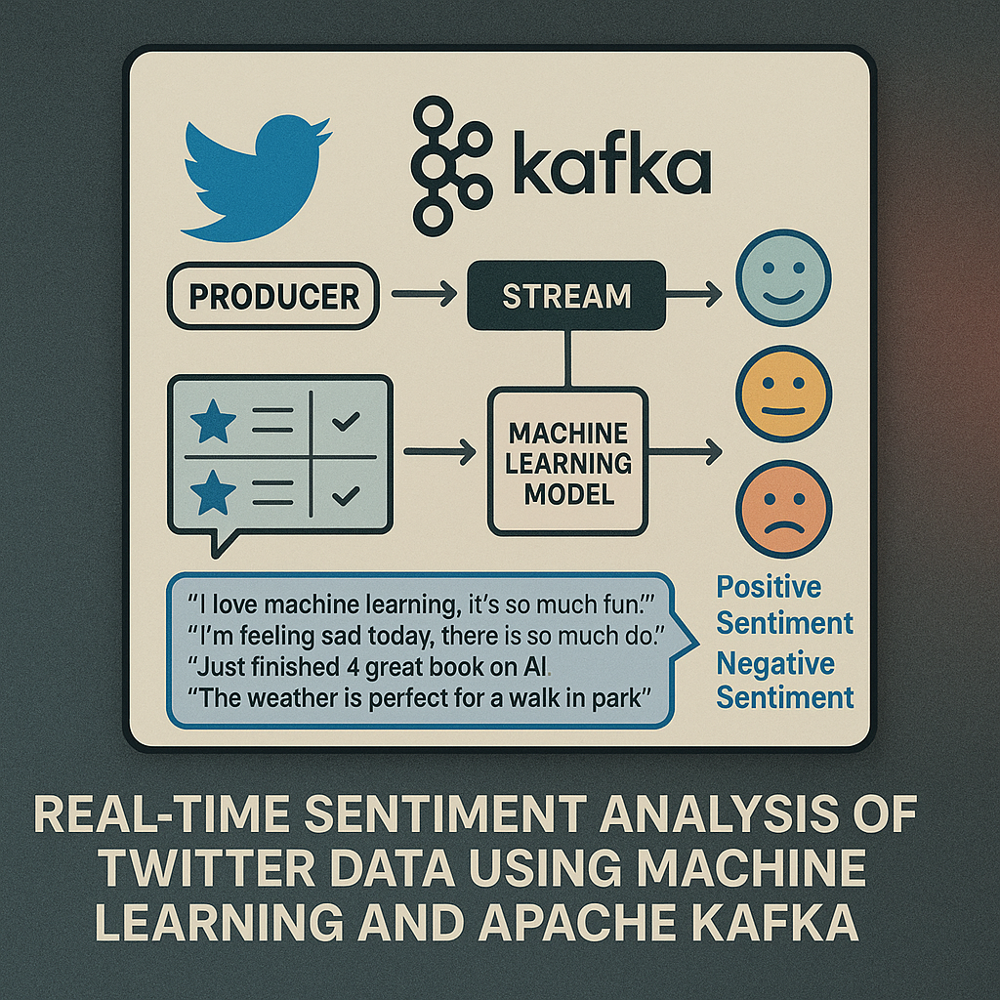
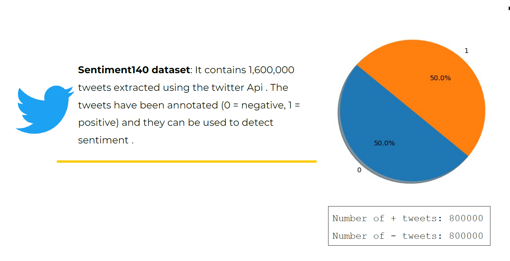
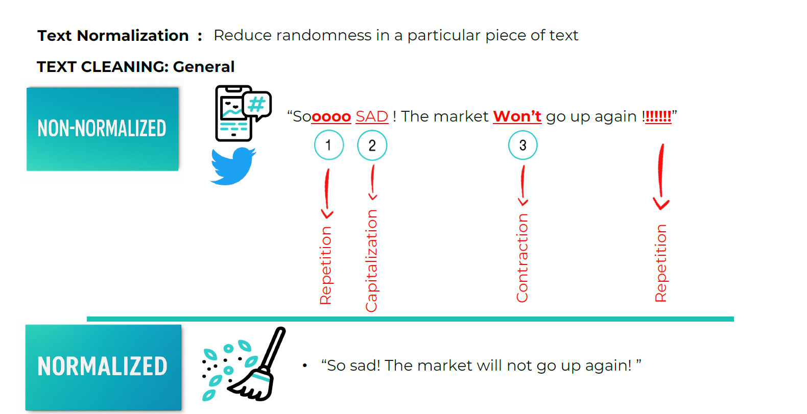
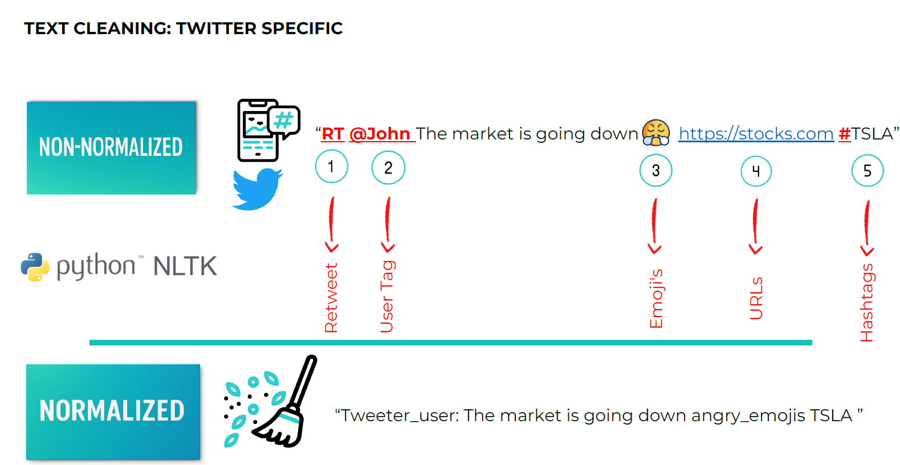
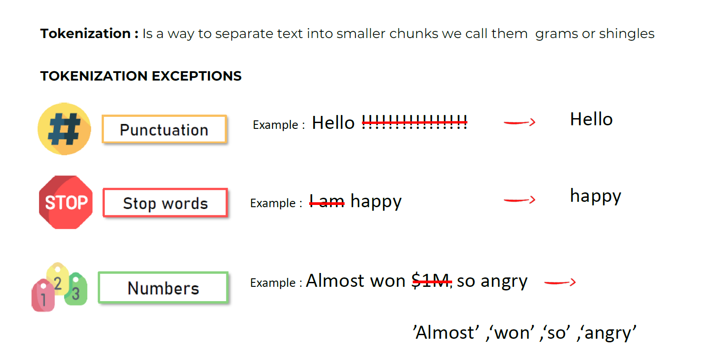
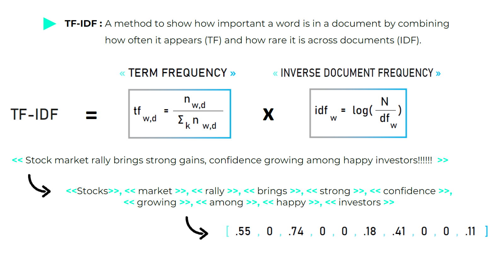
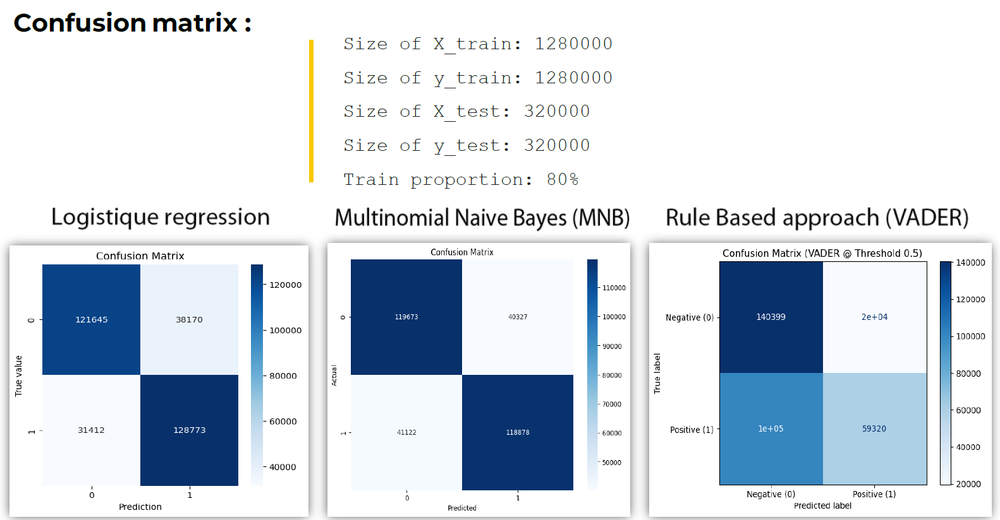
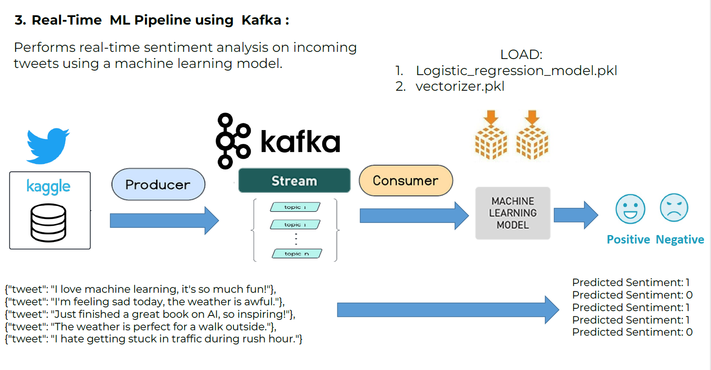

# Real-Time-Sentiment-Analysis-of-Twitter-Data-Using-Machine-Learning-and-Apache-Kafka

  

  

  

   

 

## :star2: About the Project
Within the scope of this project, I focused on the creation of multiple sentiment analysis programs. These programs were built utilizing distinctly different sentiment analysis techniques. The main objective of my work was to perform a detailed evaluation and testing of these various methodologies. I used a large dataset that is publicly available that predetermined either positive or negative sentiment (binary classification). After my distinct sentiment analysis programs were concluded, I proceeded to compare the results obtained from each methodology. The purpose of this comparison was first, to determine which methodology yielded the most accurate determination, and second, to consider the unique pros and cons inherent with each distinct methodology.

<!-- Screenshots -->
### :camera: Screenshots

 
  
  
  
  
  
    
    

<!-- TechStack -->

